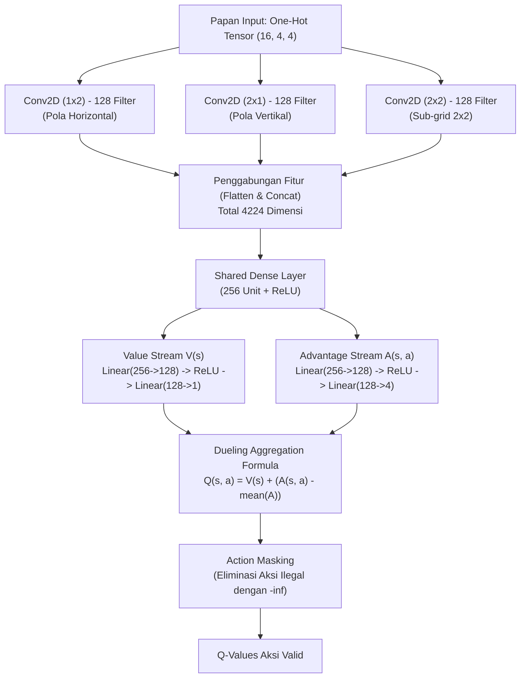

# 🎮 2048 AI: Dueling Double DQN with Directional CNN & Expectimax Search

[](https://www.python.org/)
[](https://pytorch.org/)
[](https://gymnasium.farama.org/)
[](https://developer.nvidia.com/cuda-zone)
[](LICENSE)

Implementasi agen cerdas **Reinforcement Learning** untuk menaklukkan permainan **2048** menggunakan arsitektur **Dueling Double Deep Q-Network (Double DQN)**, representasi papan **One-Hot ($16 \times 4 \times 4$)**, lapisan konvolusi khusus dengan **Directional Kernels** ($1\times2$, $2\times1$, $2\times2$), perancangan hadiah **Logarithmic Reward Shaping**, serta mesin inferensi canggih **1-Step Expectimax Lookahead Search** yang diakselerasi batch GPU.

---

## 📑 Daftar Isi

- [📌 Ikhtisar & Masalah Utama yang Dipecahkan](#-ikhtisar--masalah-utama-yang-dipecahkan)
- [✨ Fitur Unggulan](#-fitur-unggulan)
- [🧠 Arsitektur Jaringan Neural](#-arsitektur-jaringan-neural)
- [🎯 Desain Reward & Mekanisme Lingkungan](#-desain-reward--mekanisme-lingkungan)
- [🔍 Mode Inferensi: Expectimax vs Direct DQN](#-mode-inferensi-expectimax-vs-direct-dqn)
- [📁 Struktur Direktori](#-struktur-direktori)
- [⚙️ Instalasi & Kebutuhan Sistem](#️-instalasi--kebutuhan-sistem)
- [🚀 Panduan Penggunaan](#-panduan-penggunaan)
  - [1. Melatih Agen (Training)](#1-melatih-agen-training)
  - [2. Mengevaluasi Agen (Evaluation)](#2-mengevaluasi-agen-evaluation)
- [📊 Tabel Hyperparameter](#-tabel-hyperparameter)
- [🛡️ Ketahanan Sistem & Checkpointing](#️-ketahanan-sistem--checkpointing)
- [📜 Lisensi](#-lisensi)

---

## 📌 Ikhtisar & Masalah Utama yang Dipecahkan

Implementasi standar Deep Q-Learning (vanilla DQN) sering kali mengalami *plateau* (stagnan) pada ubin bernilai **128 hingga 256** karena beberapa kelemahan fundamental:

1. **Premature Exploration Death:**  
   Peluruhan $\epsilon$ (epsilon decay) pada setiap langkah transisi (*step-based decay*) menyebabkan agen kehilangan eksplorasi hanya dalam $\sim 15$ episode awal, membuat agen terjebak pada kebijakan lokal (*suboptimal local minima*).  
   👉 **Solusi:** Peluruhan $\epsilon$ dilakukan **per episode**, menjamin distribusi eksplorasi bertahan stabil hingga ratusan episode.

2. **Overestimation Bias & Moving Target:**  
   Single DQN rentan terhadap bias estimasi nilai $Q$ yang terlalu optimis dan ketidakstabilan fungsi target.  
   👉 **Solusi:** Menggunakan **Double DQN** (evaluasi aksi dengan jaringan aktif, kalkulasi target dengan target network) yang diperbarui secara periodik.

3. **Invalid Action Leaking pada Persamaan Bellman:**  
   Aksi ilegal (misalnya menggeser papan ke arah dinding saat tidak ada ubin yang bisa bergerak) sering kali mengotori target Bellman jika tidak difilter.  
   👉 **Solusi:** **Action Masking** diterapkan langsung pada penentuan target Q-learning dan seleksi aksi, membatasi pilihan hanya pada himpunan $\mathcal{A}_{\text{valid}}$.

4. **Ledakan Variansi Reward Ubin Eksponensial:**  
   Penggabungan ubin besar ($1024 + 1024 = 2048$) menghasilkan lonjakan nilai reward yang sangat masif, menghancurkan bobot jaringan yang sudah konvergen jika menggunakan loss standar seperti MSE.  
   👉 **Solusi:** Skala reward logaritmik $\log_2(\text{merged\_val})$, dipadukan dengan **Huber Loss (`SmoothL1Loss`)** dan **Gradient Clipping** ($\text{max\_norm}=1.0$).

---

## ✨ Fitur Unggulan

- **Representasi Papan One-Hot ($16 \times 4 \times 4$):** Nilai ubin tidak direpresentasikan sebagai angka skalar atau skalar datar, melainkan berupa tensor biner 3D berbasis pangkat 2 ($0, 2^1, 2^2, \dots, 2^{15}$).
- **Directional Feature Extraction:**
  - Kernel $1 \times 2$: Mendeteksi peluang penggabungan horizontal.
  - Kernel $2 \times 1$: Mendeteksi peluang penggabungan vertikal.
  - Kernel $2 \times 2$: Menangkap pola topologi lokal sub-grid $2\times2$.
- **Arsitektur Dueling Streams:** Memisahkan estimasi nilai keadaan $V(s)$ dan keuntungan relatif masing-masing aksi $A(s, a)$.
- **1-Step Expectimax Lookahead:** Menghitung nilai ekspektasi probabilistik kemunculan ubin baru (90% ubin bernilai 2, 10% ubin bernilai 4 di seluruh sel kosong) dievaluasi sekaligus dalam satu *batch forward pass* di GPU.
- **Visualisasi GUI Interaktif:** Mendukung visualisasi papan langsung menggunakan Matplotlib tanpa memblokir siklus komputasi secara berlebihan.
- **Fail-Safe Training:** Dilengkapi *graceful interruption* via `Ctrl+C` dan mekanisme *auto-resume checkpoint*.

---

## 🧠 Arsitektur Jaringan Neural

### Diagram Alur Data (Dueling Convolutional DQN)



### Formulasi Matematika

1. **Dueling Aggregation:**
   $$Q(s, a; \theta, \alpha, \beta) = V(s; \theta, \beta) + \left( A(s, a; \theta, \alpha) - \frac{1}{|\mathcal{A}|} \sum_{a'} A(s, a'; \theta, \alpha) \right)$$

2. **Action-Masked Double DQN Bellman Target:**
   $$a^* = \arg\max_{a \in \mathcal{A}_{\text{valid}}} Q(s', a; \theta_{\text{online}})$$
   $$Y^{\text{DoubleQ}} = r + \gamma (1 - d) \cdot Q(s', a^*; \theta_{\text{target}})$$

---

## 🎯 Desain Reward & Mekanisme Lingkungan

| Peristiwa (*Event*) | Formulasi Reward | Tujuan & Filosofi |
| :--- | :--- | :--- |
| **Penggabungan Ubin (*Merge*)** | $+\sum \log_2(\text{merged\_val})$ | Skala tumbuh linier terhadap tingkat ubin (misal: $2+2=4 \to 2.0$, $1024+1024=2048 \to 11.0$), mencegah ledakan gradien. |
| **Ketersediaan Sel Kosong** | $+0.1 \times N_{\text{empty}}$ | Memberikan insentif konstan untuk menjaga papan tetap memiliki ruang gerak. |
| **Kestabilan Ubin Sudut** | $+0.5$ (jika ubin terbesar $\ge 32$ ada di pojok) | Mendorong strategi klasik penataan papan monotonik menuju sudut. |
| **Langkah Ilegal (*Invalid Move*)** | $-2.0$ | Menghukum pemilihan arah geser yang tidak mengubah kondisi papan. |
| **Kalah / Papan Macet (*Game Over*)** | $-5.0$ | Penalti akhir saat tidak ada langkah valid yang tersisa. |

---

## 🔍 Mode Inferensi: Expectimax vs Direct DQN

Script evaluasi (`evaluate.py`) mendukung dua mode pengambilan keputusan:

```
                      Mode Pengambilan Aksi
                                │
        ┌───────────────────────┴───────────────────────┐
        ▼                                               ▼
1-Step Expectimax (Default)                   Direct DQN (Greedy)
┌─────────────────────────────────┐   ┌─────────────────────────────────┐
│ • Mensimulasikan hasil geser    │   │ • Mengambil observasi saat ini  │
│ • Menghitung probabilitas spawn │   │ • Forward pass langsung 1 state │
│   (90% tile 2, 10% tile 4)      │   │ • Memilih argmax Q-value aksi   │
│ • Batch forward pass di GPU     │   │   yang valid                    │
│ • Menghasilkan skor jauh lebih  │   │ • Sangat cepat (cocok untuk     │
│   tinggi dan stabil             │   │   benchmark berkecepatan tinggi)│
└─────────────────────────────────┘   └─────────────────────────────────┘
```

Formulasi **1-Step Expectimax**:
$$\mathbb{E}[V(s')] = \sum_{c \in \text{empty}} \frac{1}{|\text{empty}|} \left( 0.9 \cdot \max_{a'} Q(s'_{c \leftarrow 2}, a') + 0.1 \cdot \max_{a'} Q(s'_{c \leftarrow 4}, a') \right)$$
$$\text{Action}^* = \arg\max_{a \in \mathcal{A}_{\text{valid}}} \left[ r_{\text{merge}}(s, a) + \gamma \cdot \mathbb{E}[V(s')] + 0.2 \cdot |\text{empty}| \right]$$

---

## 📁 Struktur Direktori

```text
2048ai/
├── game2048_env.py     # Lingkungan kustom Gymnasium (log-rewards, valid action check, GUI Matplotlib)
├── train_dqn.py        # Implementasi Dueling Double DQN, Experience Replay, dan loop pelatihan
├── evaluate.py         # Script evaluasi performa (1-Step Expectimax & Direct DQN, GUI live visualizer)
├── best_2048_model.pth # Checkpoint model terbaik (bobot model, optimizer, nilai epsilon)
├── .gitignore          # Konfigurasi file yang diabaikan oleh Git
└── README.md           # Dokumentasi teknis proyek
```

---

## ⚙️ Instalasi & Kebutuhan Sistem

### Kebutuhan
- **Python:** 3.10 atau versi lebih baru
- **GPU:** NVIDIA GPU direkomendasikan dengan CUDA toolkit (CPU tetap didukung secara otomatis)

### Langkah Instalasi

1. **Clone repositori:**
   ```bash
   git clone https://github.com/<username>/2048ai.git
   cd 2048ai
   ```

2. **Buat dan aktifkan Virtual Environment:**
   - **Windows (PowerShell):**
     ```powershell
     python -m venv venv
     .\venv\Scripts\Activate.ps1
     ```
   - **Linux / macOS:**
     ```bash
     python3 -m venv venv
     source venv/bin/activate
     ```

3. **Install Dependensi:**
   ```bash
   pip install torch torchvision gymnasium numpy matplotlib
   ```

> [!TIP]
> Jika memiliki kartu grafis NVIDIA, pastikan PyTorch dengan dukungan CUDA terpasang agar proses simulasi *Expectimax* berjalan maksimal:
> ```bash
> pip install torch torchvision --index-url https://download.pytorch.org/whl/cu121
> ```

---

## 🚀 Panduan Penggunaan

### 1. Melatih Agen (Training)

Untuk memulai pelatihan agen baru atau melanjutkan dari checkpoint `best_2048_model.pth`:

```bash
python train_dqn.py
```

**Fitur Selama Pelatihan:**
- **Auto Checkpoint:** Model dan optimizer otomatis tersimpan ke `best_2048_model.pth` setiap kali agen mencetak rekor skor baru atau mencapai ubin yang lebih tinggi.
- **Visualisasi Periodik:** GUI papan akan muncul secara otomatis setiap 50 episode untuk memantau perkembangan strategi agen.
- **Safe Interruption (`Ctrl+C`):** Anda dapat menghentikan proses kapan saja dengan `Ctrl+C`. Progres terakhir, status optimizer, dan nilai epsilon saat itu akan otomatis disimpan.

---

### 2. Mengevaluasi Agen (Evaluation)

Gunakan `evaluate.py` untuk menguji performa model yang telah dilatih secara murni eksploitasi ($\epsilon = 0$).

#### A. Menonton AI Bermain Langsung (Live Interactive GUI)
```bash
# Menonton 1 game dengan mode 1-Step Expectimax (jeda langkah 0.03 detik)
python evaluate.py --games 1 --visualize --delay 0.03

# Menggunakan mode Direct DQN (Greedy Policy murni)
python evaluate.py --games 1 --visualize --mode direct --delay 0.05
```

#### B. Benchmark Performa Massal (Headless / Cepat)
```bash
# Uji 10 game dengan mode Expectimax Lookahead
python evaluate.py --games 10 --mode expectimax

# Uji 20 game cepat menggunakan Direct DQN
python evaluate.py --games 20 --mode direct
```

#### Opsi Argumen CLI `evaluate.py`:

| Argumen | Tipe | Default | Deskripsi |
| :--- | :---: | :---: | :--- |
| `--games` | `int` | `5` | Jumlah game yang akan diuji. |
| `--mode` | `str` | `expectimax` | Metode pemilihan aksi: `expectimax` atau `direct`. |
| `--visualize` | `flag` | `False` | Mengaktifkan tampilan jendela GUI papan interaktif. |
| `--delay` | `float` | `0.03` | Waktu jeda antar langkah dalam detik saat visualisasi aktif. |
| `--model` | `str` | `best_2048_model.pth` | Path ke file checkpoint bobot model PyTorch. |

---

## 📊 Tabel Hyperparameter

| Parameter | Nilai | Keterangan |
| :--- | :---: | :--- |
| **Batch Size** | `64` | Ukuran mini-batch saat pengambilan sampel memori replay. |
| **Replay Memory Capacity** | `50,000` | Batas maksimum transisi $(s, a, r, s', d, \mathcal{A}_{\text{valid}})$ yang disimpan. |
| **Discount Factor ($\gamma$)** | `0.99` | Faktor diskon untuk nilai reward jangka panjang. |
| **Learning Rate** | `3e-4` | Learning rate untuk Adam optimizer. |
| **Loss Function** | `SmoothL1Loss` | Huber loss yang tahan terhadap *outlier* dan lonjakan gradien. |
| **Target Sync Frequency** | `250 steps` | Frekuensi penyalinan bobot jaringan aktif ke target network. |
| **Epsilon Awal / Minimal** | `1.0` / `0.02` | Rentang probabilitas eksplorasi acak agen. |
| **Epsilon Decay Rate** | `0.995` / episode | Penurunan epsilon per episode (menjangkau $\epsilon_{\min}$ dalam $\sim 800$ episode). |
| **Gradient Clipping Norm** | `1.0` | Pemotongan norma gradien untuk stabilitas *backpropagation*. |

---

## 🛡️ Ketahanan Sistem & Checkpointing

Checkpoint model yang disimpan (`best_2048_model.pth`) bersifat komprehensif dan mencakup:
1. `model_state`: Bobot parameter arsitektur Dueling DQN.
2. `optimizer_state`: Status momentum dan *adaptive learning rates* dari Adam optimizer.
3. `epsilon`: Nilai epsilon eksplorasi saat model disimpan.

Jika proses pelatihan dihentikan mendadak, Anda cukup menjalankan kembali `python train_dqn.py` dan pelatihan akan otomatis dilanjutkan secara mulus (*seamless resume*).

---

## 📜 Lisensi

Proyek ini dilisensikan di bawah [MIT License](LICENSE). Bebas digunakan, dimodifikasi, dan didistribusikan untuk kepentingan penelitian, edukasi, maupun pengembangan lebih lanjut.
