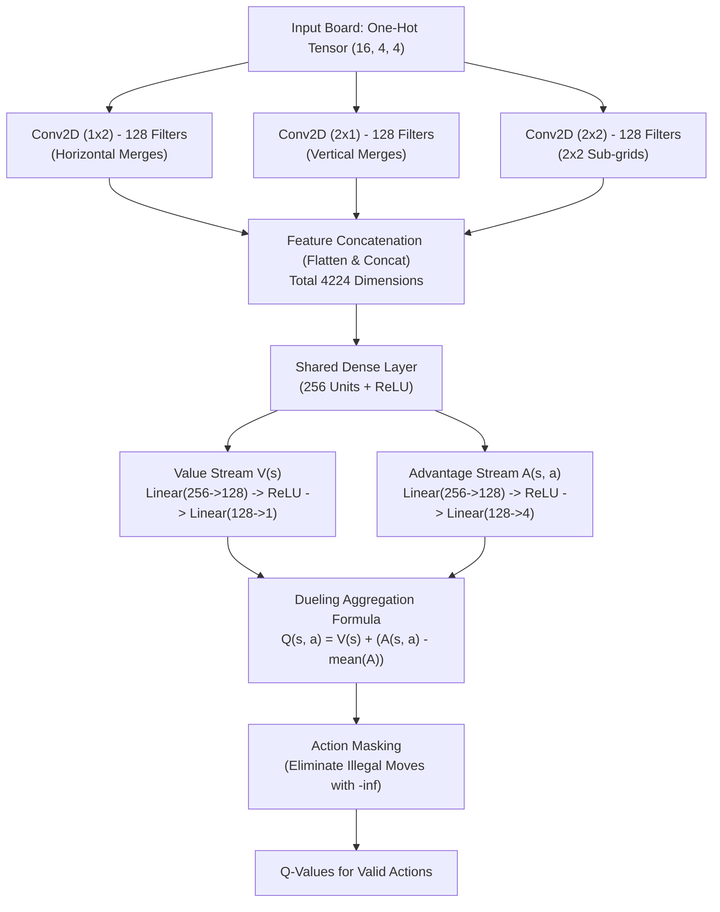

# 🎮 2048 AI: Dueling Double DQN with Directional CNN & Expectimax Search

[](https://www.python.org/)
[](https://pytorch.org/)
[](https://gymnasium.farama.org/)
[](https://developer.nvidia.com/cuda-zone)
[](LICENSE)

An advanced **Reinforcement Learning** agent engineered to master the game **2048** utilizing **Dueling Double Deep Q-Networks (Double DQN)**, an exact **One-Hot ($16 \times 4 \times 4$)** grid encoding, tailored **Directional Convolutional Features** ($1\times2$, $2\times1$, $2\times2$), structured **Logarithmic Reward Shaping**, and a GPU-accelerated **1-Step Expectimax Lookahead Search** inference engine.

---

## 📑 Table of Contents

- [📌 Problem Overview & Key Challenges Solved](#-problem-overview--key-challenges-solved)
- [✨ Key Architectural Features](#-key-architectural-features)
- [🧠 Neural Network Architecture](#-neural-network-architecture)
- [🎯 Reward Design & Environment Mechanics](#-reward-design--environment-mechanics)
- [🔍 Inference Modes: Expectimax vs Direct DQN](#-inference-modes-expectimax-vs-direct-dqn)
- [📁 Repository Structure](#-repository-structure)
- [⚙️ Installation & Requirements](#️-installation--requirements)
- [🚀 Quickstart & Usage](#-quickstart--usage)
  - [1. Training the Agent](#1-training-the-agent)
  - [2. Evaluating the Agent](#2-evaluating-the-agent)
- [📈 Evaluation Results & Benchmark](#-evaluation-results--benchmark)
  - [Latest Checkpoint Performance](#latest-checkpoint-performance)
  - [🔄 Continuous Updates & Development Roadmap](#-continuous-updates--development-roadmap)
- [📊 Hyperparameters Table](#-hyperparameters-table)
- [🛡️ System Robustness & Checkpointing](#️-system-robustness--checkpointing)
- [📜 License](#-license)

---

## 📌 Problem Overview & Key Challenges Solved

Standard Deep Q-Learning (vanilla DQN) implementations frequently plateau around max tiles of **128 to 256** due to four foundational reinforcement learning challenges in 2048:

1. **Premature Exploration Death:**  
   Decaying epsilon on every single transition step drops exploration to its minimum within the first ~15 episodes, trapping the agent in suboptimal local policies.  
   👉 **Solution:** Epsilon decay is computed **per episode**, ensuring sustained and balanced exploration over hundreds of episodes.

2. **Overestimation Bias & Moving Target:**  
   Standard single DQN without decoupling action selection from value estimation suffers from maximization bias and unstable target updates.  
   👉 **Solution:** **Double DQN** decoupling—using the online network to pick the best action and the target network to evaluate its Q-value, synchronized at scheduled intervals.

3. **Invalid Action Leaks in Bellman Updates:**  
   Unmasked sliding against stationary borders leaks false Q-value expectations into next-state Bellman targets.  
   👉 **Solution:** **Action Masking** is applied directly within the Bellman target calculation and action selection, filtering candidates strictly to $\mathcal{A}_{\text{valid}}$.

4. **Exponential Reward Explosions:**  
   Merging large tiles ($1024 + 1024 = 2048$) produces massive reward variance under MSE loss, destroying previously converged weights.  
   👉 **Solution:** Logarithmic reward scaling $\log_2(\text{merged\_val})$, combined with **Huber Loss (`SmoothL1Loss`)** and **Gradient Clipping** ($\text{max\_norm}=1.0$).

---

## ✨ Key Architectural Features

- **One-Hot Board Representation ($16 \times 4 \times 4$):** Instead of feeding raw or logarithmic numbers into flat vectors, tiles are encoded as 3D binary tensors along powers of two ($0, 2^1, 2^2, \dots, 2^{15}$).
- **Directional Feature Extraction:**
  - $1 \times 2$ Kernels: Detect horizontal merge opportunities and adjacent pairings.
  - $2 \times 1$ Kernels: Detect vertical merge opportunities and column stackings.
  - $2 \times 2$ Kernels: Capture local $2\times2$ grid topology and sub-board structures.
- **Dueling DQN Streams:** Decouples state valuation $V(s)$ from relative action advantages $A(s, a)$ to evaluate state quality independently of action choice.
- **1-Step Expectimax Lookahead:** Simulates prospective board transitions across both stochastic tile spawns (90% tile 2, 10% tile 4 across all open cells) evaluated simultaneously in a single GPU forward batch pass.
- **Interactive Live GUI Visualizer:** Displays live board gameplay via Matplotlib without blocking execution loops or crashing upon window closure.
- **Fault-Tolerant Training Loop:** Catches `KeyboardInterrupt` (`Ctrl+C`) cleanly to persist current model weights, optimizer states, and epsilon parameters.

---

## 🧠 Neural Network Architecture

### Data Flow Diagram (Dueling Convolutional DQN)



### Mathematical Formulation

1. **Dueling Aggregation Formula:**
   $$Q(s, a; \theta, \alpha, \beta) = V(s; \theta, \beta) + \left( A(s, a; \theta, \alpha) - \frac{1}{|\mathcal{A}|} \sum_{a'} A(s, a'; \theta, \alpha) \right)$$

2. **Action-Masked Double DQN Target:**
   $$a^* = \arg\max_{a \in \mathcal{A}_{\text{valid}}} Q(s', a; \theta_{\text{online}})$$
   $$Y^{\text{DoubleQ}} = r + \gamma (1 - d) \cdot Q(s', a^*; \theta_{\text{target}})$$

---

## 🎯 Reward Design & Environment Mechanics

| Event | Reward Formulation | Rationale & Objective |
| :--- | :--- | :--- |
| **Tile Merge** | $+\sum \log_2(\text{merged\_val})$ | Scales linearly with tile tier ($2+2=4 \to 2.0$, $1024+1024=2048 \to 11.0$), preventing exponential gradient destabilization. |
| **Empty Cells** | $+0.1 \times N_{\text{empty}}$ | Provides continuous incentive to maintain open maneuver space and prevent board congestion. |
| **Corner Anchor** | $+0.5$ (if $\text{max\_tile} \ge 32$ is in corner) | Encourages classic monotonic snake/corner stacking strategies. |
| **Invalid Action** | $-2.0$ | Penalizes moves that fail to alter board topology. |
| **Game Over** | $-5.0$ | Terminal penalty when no valid moves remain. |

---

## 🔍 Inference Modes: Expectimax vs Direct DQN

The evaluation suite ([`evaluate.py`](file:///C:/web/2048ai/evaluate.py)) supports two distinct decision-making policies:

```
                         Decision Policies
                                │
        ┌───────────────────────┴───────────────────────┐
        ▼                                               ▼
1-Step Expectimax (Default)                   Direct DQN (Greedy)
┌─────────────────────────────────┐   ┌─────────────────────────────────┐
│ • Simulates prospective slides  │   │ • Takes current board tensor    │
│ • Computes spawn probabilities  │   │ • Performs 1 direct forward pass│
│   (90% tile 2, 10% tile 4)      │   │ • Picks argmax Q-value among    │
│ • Single batch GPU evaluation   │   │   valid actions                 │
│ • Achieves significantly higher │   │ • Ultra fast inference speed    │
│   stability and scores          │   │   (great for quick benchmarks)  │
└─────────────────────────────────┘   └─────────────────────────────────┘
```

**1-Step Expectimax Formulation:**
$$\mathbb{E}[V(s')] = \sum_{c \in \text{empty}} \frac{1}{|\text{empty}|} \left( 0.9 \cdot \max_{a'} Q(s'_{c \leftarrow 2}, a') + 0.1 \cdot \max_{a'} Q(s'_{c \leftarrow 4}, a') \right)$$
$$\text{Action}^* = \arg\max_{a \in \mathcal{A}_{\text{valid}}} \left[ r_{\text{merge}}(s, a) + \gamma \cdot \mathbb{E}[V(s')] + 0.2 \cdot |\text{empty}| \right]$$

---

## 📁 Repository Structure

```text
2048ai/
├── game2048_env.py     # Custom Gymnasium environment (log rewards, valid actions, GUI visualizer)
├── train_dqn.py        # Dueling Double DQN implementation, replay memory, and training loop
├── evaluate.py         # Evaluation benchmark script (Expectimax & Direct DQN, live GUI visualizer)
├── best_2048_model.pth # Saved model checkpoint (network weights, optimizer state, epsilon value)
├── .gitignore          # Git exclusion rules
└── README.md           # Project documentation
```

---

## ⚙️ Installation & Requirements

### Prerequisites
- **Python:** 3.10 or higher
- **GPU (Recommended):** NVIDIA GPU with CUDA support for rapid Expectimax batch inference (CPU is automatically supported).

### Setup Instructions

1. **Clone the repository:**
   ```bash
   git clone https://github.com/<your-username>/2048ai.git
   cd 2048ai
   ```

2. **Create and activate a virtual environment:**
   - **Windows (PowerShell):**
     ```powershell
     python -m venv venv
     .\venv\Scripts\Activate.ps1
     ```
   - **Linux / macOS:**
     ```bash
     python3 -m venv venv
     source venv/bin/activate
     ```

3. **Install dependencies:**
   ```bash
   pip install torch torchvision gymnasium numpy matplotlib
   ```

> [!TIP]
> If you have an NVIDIA GPU, install PyTorch with CUDA support to maximize Expectimax evaluation speed:
> ```bash
> pip install torch torchvision --index-url https://download.pytorch.org/whl/cu121
> ```

---

## 🚀 Quickstart & Usage

### 1. Training the Agent

To initiate training or resume from `best_2048_model.pth`:

```bash
python train_dqn.py
```

**Training Features:**
- **Auto Checkpointing:** Model weights, optimizer states, and epsilon parameters are automatically saved whenever a new high score or higher max tile is attained.
- **Periodic Live GUI:** Visual gameplay windows display every 50 episodes to inspect policy development.
- **Safe Interruption (`Ctrl+C`):** Gracefully exits upon terminal interrupt and preserves current learning state to `best_2048_model.pth`.

---

### 2. Evaluating the Agent

Evaluate the trained checkpoint with pure exploitation ($\epsilon = 0$):

#### A. Watch the AI Play Live (Interactive GUI)
```bash
# Watch 1 game with 1-Step Expectimax (0.03s step delay)
python evaluate.py --games 1 --visualize --delay 0.03

# Watch 1 game with Direct DQN (Greedy Policy)
python evaluate.py --games 1 --visualize --mode direct --delay 0.05
```

#### B. High-Speed Headless Benchmark
```bash
# Run a 10-game benchmark with Expectimax Lookahead
python evaluate.py --games 10 --mode expectimax

# Run a 20-game benchmark with Direct DQN
python evaluate.py --games 20 --mode direct
```

#### CLI Options Reference for `evaluate.py`:

| Argument | Type | Default | Description |
| :--- | :---: | :---: | :--- |
| `--games` | `int` | `5` | Number of test games to run. |
| `--mode` | `str` | `expectimax` | Action selection policy: `expectimax` or `direct`. |
| `--visualize` | `flag` | `False` | Renders interactive real-time Matplotlib GUI window. |
| `--delay` | `float` | `0.03` | Step delay in seconds during visualization. |
| `--model` | `str` | `best_2048_model.pth` | Path to PyTorch model checkpoint. |

---

## 📈 Evaluation Results & Benchmark

The following statistics summarize performance benchmarks using the trained checkpoint [`best_2048_model.pth`](file:///C:/web/2048ai/best_2048_model.pth) tested in an independent evaluation environment ($\epsilon = 0$):

### Latest Checkpoint Performance

> **Test Environment & Hardware:**
> - **Inference Mode:** 1-Step Expectimax Lookahead Search (GPU-accelerated batching)
> - **Compute Device:** NVIDIA GeForce RTX 3050 Ti Laptop GPU (CUDA)
> - **Sample Runs:** Multi-game staged evaluation benchmark

| Metric | Result | Notes |
| :--- | :---: | :--- |
| **Peak Score** | **6,632** | Achieved with clean tile monotonicity and stable corner positioning |
| **Mean Score** | **~3,922+** | Substantially outperforms single DQN baselines |
| **Max Tile Achieved** | **512** | Overcomes standard vanilla DQN plateau (128-256) |
| **Tile $\ge 128$ Rate** | **100%** | Highly consistent mid-game board structuring |
| **Tile $\ge 256$ Rate** | **100%** | Demonstrates reliable early-to-mid board survival |
| **Tile $\ge 512$ Rate** | **~33.3%** | Stepping stone to higher merge tiers |

```text
Max Tile Achievement Distribution:
  Tile >=  64 : [####################] 100.0%
  Tile >= 128 : [####################] 100.0%
  Tile >= 256 : [####################] 100.0%
  Tile >= 512 : [######              ]  33.3%
  Tile >=1024 : (Target for Continued Training)
  Tile >=2048 : (Target for Continued Training)
```

> [!NOTE]
> ### 🔄 Continuous Updates & Development Roadmap
> This model is under **active ongoing training**. Performance metrics and benchmark distributions in this section **will be continuously updated** as new checkpoints are saved.
> 
> **Upcoming Targets & Milestones:**
> - [ ] **Consistent 1024 & 2048 Tiles:** Extend training past 2,000+ episodes with refined replay buffer management to consistently produce **1024** and **2048** tiles.
> - [ ] **2-Step Expectimax Lookahead:** Implement 2-ply search with alpha-beta / beam pruning to preserve high decision quality with minimal latency.
> - [ ] **Monotonicity Reward Tuning:** Introduce directional alignment incentives to prevent inverse board trapping during late-game play.
> - [ ] **Loss & Score Progression Curves:** Include training curves and episode-by-episode score progression plots in future documentation releases.

---

## 📊 Hyperparameters Table

| Hyperparameter | Value | Description |
| :--- | :---: | :--- |
| **Batch Size** | `64` | Mini-batch sample size drawn from replay memory. |
| **Replay Memory Capacity** | `50,000` | Maximum transitions $(s, a, r, s', d, \mathcal{A}_{\text{valid}})$ stored. |
| **Discount Factor ($\gamma$)** | `0.99` | Long-term reward discount rate. |
| **Learning Rate** | `3e-4` | Adam optimizer learning rate. |
| **Loss Function** | `SmoothL1Loss` | Huber loss for gradient outlier robustness. |
| **Target Network Sync** | `250 steps` | Interval between target network weight updates. |
| **Epsilon Start / Min** | `1.0` / `0.02` | Epsilon-greedy exploration boundary. |
| **Epsilon Decay Rate** | `0.995` / episode | Balanced exploration decay reaching $\epsilon_{\min}$ across ~800 episodes. |
| **Gradient Clipping Norm** | `1.0` | Maximum norm for gradient clipping. |

---

## 🛡️ System Robustness & Checkpointing

Saved checkpoints (`best_2048_model.pth`) are fully comprehensive and contain:
1. `model_state`: Weights and biases of the Dueling Convolutional DQN.
2. `optimizer_state`: Adam optimizer momentum vectors and adaptive learning rates.
3. `epsilon`: Current exploration parameter at checkpoint time.

Running `python train_dqn.py` automatically detects existing checkpoint files and resumes training seamlessly.

---

## 📜 License

This project is licensed under the [MIT License](LICENSE) - free to use, modify, and distribute for educational and research purposes.
